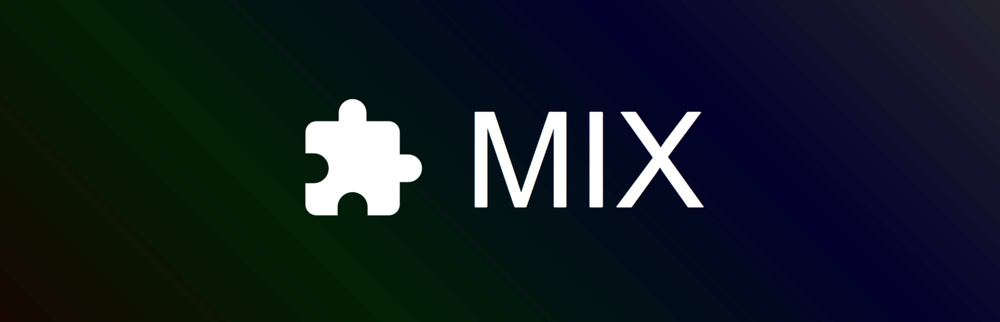

Mix enables combining creator content for custom Unity games. Few modules exist now, offering creators a chance to contribute. Use modpacks for new features, collaborate via Steam Workshop, and monetize with no Mix fees. Join to pioneer modular gaming.

# Mix

Mix's mission is to let you combine content from thousands of creators to craft your ultimate gaming experience. At the moment, there are very few, if any, content modules available. If you're a creator, you have a unique opportunity to be among the first to contribute to the Mix Workshop.

Combine modular content (modules) into modpacks to make custom experiences in the Unity Engine. Modules are loaded from assemblies. This allows for a wide variety of new features like new game modes, MMO capabilities, advanced physics, high-fidelity graphics, and massive worlds. With the Steam Workshop and module dependencies, you can collaborate with other creators by sharing modules that build upon each other. Create modules entirely in the Unity Editor. You can independently monetize your work, or use Mix's upcoming microtransactions system.

Join now and start creating your own modules, so you can later sell them using the upcoming Module Microtransactions feature. Let's pioneer the future of modular gaming and community-sourced game development!

## Why Create Modules for Mix?
### Early Market Entry  
Being one of the first creators on the platform gives you a chance to establish your name and potentially become a leading figure in this new ecosystem.  
### Monetization Opportunities  
Directly monetize your modules or benefit from Mix's future microtransactions system, providing a new revenue stream for your creations.  
### Low Overhead 
Unlike developing a full game from scratch, creating modules can be less resource-intensive, allowing creators with limited resources to participate.  
### Increased Product Lifespan  
Extend the longevity of your creations by designing modules that remain relevant across multiple projects and communities. As more users incorporate your content into their's, the value of your work grows over time. 
### Flexibility 
Create modules that can be used in multiple games or modpacks, increasing your content's reach, utility, and reusability. 
### More Product Ideas  
The ability to mod existing modules opens up endless creative possibilities. By building upon or remixing existing content, creators can introduce new features, refine mechanics, or adapt modules to entirely different contexts. This iterative approach encourages collaboration, sparks inspiration, and significantly lowers the barrier to generating innovative, high-quality content.  

## Upcoming Features
- **Module Microtransactions**: A platform where creators can sell modules, enabling them to earn money from their creations, foster the development of premium content, and receive financial support. This will be done with Steam Inventory Service Items dynamically linked to Steam Workshop Items. Your customers will have a streamlined shopping experience with automatic dependency purchasing and installation. Mix will charge a 4% server fee, which may decrease as we optimize this system.

## New Features (Dec 27)
- **Module Dependencies**: A system to manage module dependencies and ensure they load in the correct order, minimizing conflicts and allowing creators to build upon each other's work.
- **Automatic Dependency Installation**: Automatically install missing dependencies when playing a modpack.
- **Module Exporter/Builder**: A Unity script is provided to help prepare modules for sharing. This script exports the module's assets and metadata to a folder, which can then be uploaded to the Steam Workshop.
- **Example Modules**: Three example modules ("HarmonyMod", "ThirdPersonPlayground", and "FallingCubes") are included to demonstrate how modules can be created and used. These modules can be downloaded from the Steam Workshop.
- **Snackbar Notifications**: Improved user feedback when using the mod manager with snackbar notifications.

## Features (Dec 21)
- **Module Manager**: Supports downloading, publishing, updating modules, and creating modpacks.
- **Module Loader**: A system for loading modules within the game. Mix loads the assemblies of modules and instantiates a subclass of `Mix.Mod` defined in each mod's assembly.
- **Create in the Unity Editor**: Creators can build modules entirely in Unity (version 6000.0.23f1), leveraging the engine's powerful tools and workflows.
- **Module Monetization**: Monetize your modules with no fees from Mix, though Module Microtransactions are in development.
- **Steam Workshop Integration**: Use the Steam Workshop to browse, download, and share modules.
- **Asset Sharing**: Creators are recommended to allow others to use and reference their assets in modules, but redistribution is not permitted. This means players must own the dependency module to use dependent modules that reference it, so the creators of the dependency benefit from the dependent's popularity. This optional policy supports Mix’s vision of fostering a vast and ever-growing library of content by promoting the free flow of ideas and resources, encouraging collaboration and accelerating development. 
- **Documentation**: Material on GitHub to help users get started.

## Pre-requisites
1. Install Unity version 6000.0.23f1 from [Unity Editor Archive](https://unity.com/releases/editor/archive).

## HOW-TO: Create and publish a module that loads Unity's ThirdPersonController Playground scene
1. See the `Assets/ThirdPersonPlayground` folder to see the reference module.
1. Clone this repository and open it in Unity.
1. Re-import Unity's Starter Assets: ThirdPersonController from the Asset Store.
1. Create a folder for your module in the `Assets` folder. For example, `Assets/MyPlayground`.
1. Create a file called `metadata.json` in that folder. This file should contain the following:
   ```json
   {
	 "title": "MyPlayground",
	 "description": "A module that loads Unity's ThirdPersonController Playground scene.",
	 "dependencies": []
   }
   ```
	1. `dependencies` is an array of the ID of the modules that this module depends on. For example, if your module depends on another module called `HarmonyMod`, you would write `"dependencies": ["HarmonyMod"]`. If depending on a Workshop module, use the Workshop ID. If depending on a local module, use the module's folder name.
1. Create a C# script in the `Scripts` folder that extends `Mix.Mod`. For example, `Mod.cs`:
   ```csharp
	using UnityEngine;
	using UnityEngine.SceneManagement;

	namespace MyPlayground
	{
		public class Mod : Mix.Mod
		{
			public override void OnLoad(string id)
			{
				var scenePaths = this.sceneAssetBundle.GetAllScenePaths();
				SceneManager.LoadScene(scenePaths[0]);
			}
		}
	}
   ```
	1. `OnLoad` is called when the module is loaded. In this example, it loads the first scene in the module's asset bundle. `OnLoad` is called after this module's dependencies' `OnLoad` methods are called.
	1. `this.sceneAssetBundle` is a loaded AssetBundle containing the module's scenes at `Assets/MyPlayground/Scenes`.
	1. `this.assetBundle` is a loaded AssetBundle containing the module's non-scene assets at `Assets/MyPlayground/Assets`.
1. Create an Assembly Definition file in the folder's `Scripts` folder. For example, `Scripts/MyPlayground.asmdef`:
	1. Unity will generate a `.dll` file for this module at `Library/ScriptAssemblies/MyPlayground.dll`. This file is required for the module to be loaded by Mix.
1. Copy the `Playground` scene from the ThirdPersonController asset to the module's `Scenes` folder. (`Assets/Starters/ThirdPersonController/Scenes/Playground.unity`).
	1. This is for convenience with Mix's module exporter.
1. Create a Assembly Definition for at `StarterAssets/StarterAssets.asmdef` since it contains logic that is used the `Playground` scene.
	1. Add `Unity.InputSystem` to the references.
1. Edit `Assets/Mix/Editor/CreateAssetBundles.cs`'s `BuildModules` method to include your module:
   ```csharp
	[MenuItem("Mix/BuildMods")]
	public static void BuildModules()
	{
		ExportMod("Assets/MyPlayground");
	}
   ```
1. On the toolbar, click `Mix` -> `BuildMods` to export the module to a `Build/Mix/items` folder.
1. Copy `Library/ScriptAssemblies/StarterAssets.dll` to the `Build/Mix/items/MyPlayground/Assemblies` folder.
1. Copy `Library/ScriptAssemblies/Cinemachine.dll` to the `Build/Mix/items/MyPlayground/Assemblies` folder.
1. Copy `Build/Mix/items/MyPlayground` to the `AppData/LocalLow/Mix Team/Mix/items` folder so Mix can detect the module.
1. In the Mix Launcher, click the module's gear button and publish to the Workshop!

## Testing Your Modpack in the Unity Editor
You can test your modpack directly within the Unity Editor:

1. Click the `LOAD ON START` option in the Mix Launcher.
   - This option writes the modpack configuration to `AppData/LocalLow/Mix Team/Mix/modIdAndPaths.json`.
   - This list of mods will be loaded in order when the scene is played.
1. Play the `Assets/Mix/Scenes/Main` scene to load and test your modpack.
